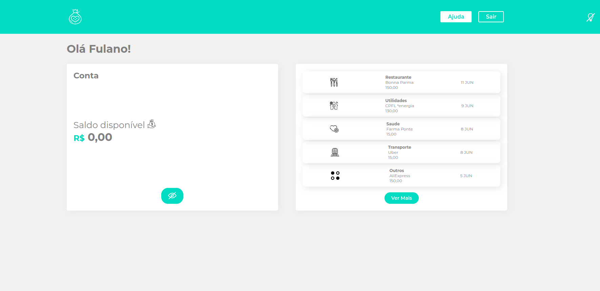
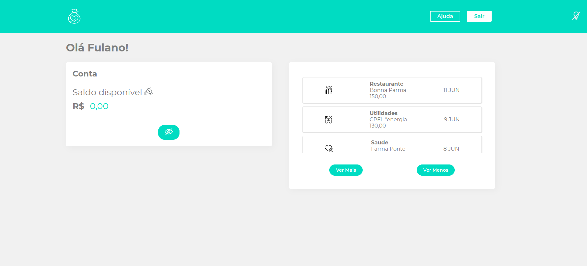
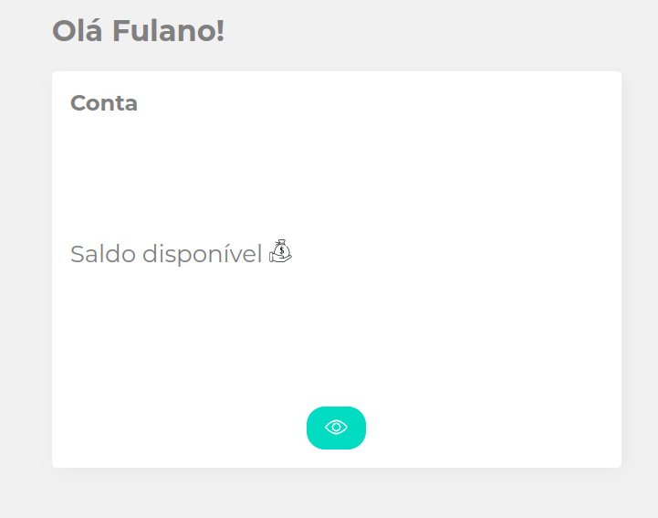
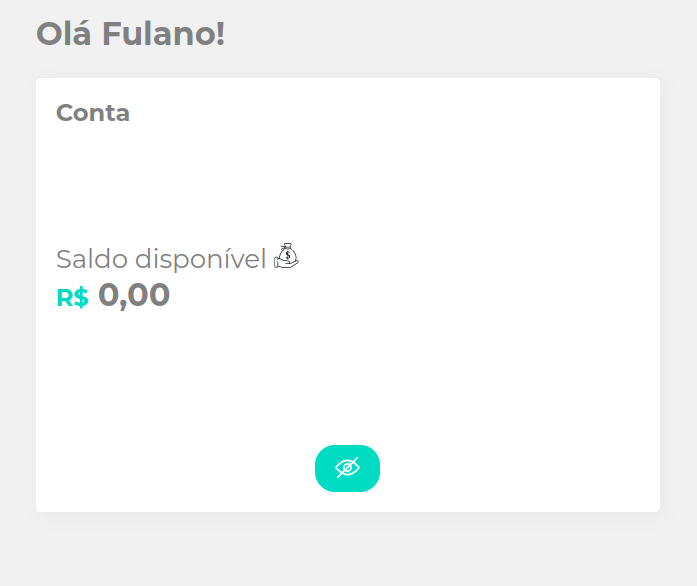
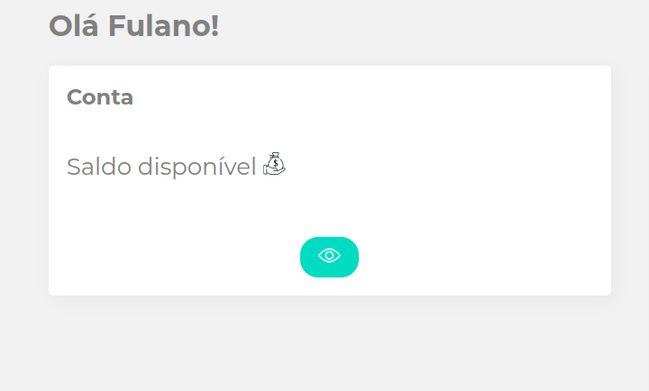
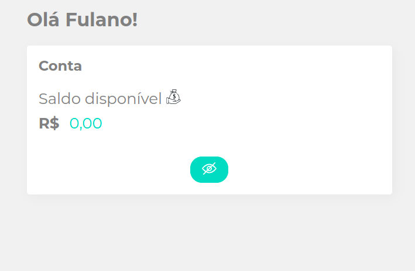
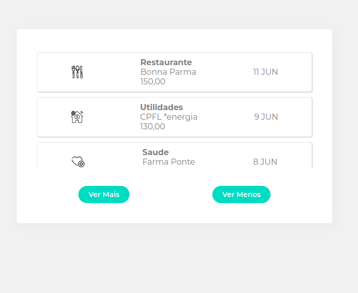
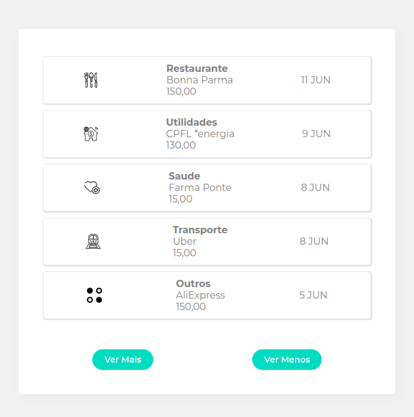
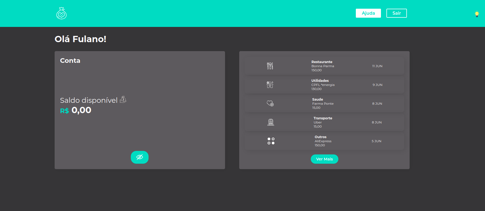
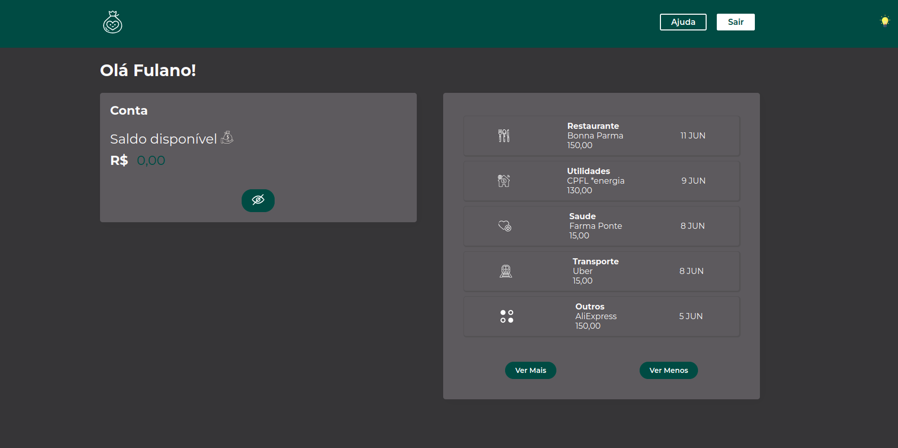

# Abstraindo CSS com Styled Components

Projeto realizado durante o curso Alura **"React: Abstraindo seu CSS com Styled Components"** ministrado pela instrutora **Elaine Matos**.

Trata-se de uma página mocada que apresenta o saldo de uma conta ficticia e o extrato com o detalhamento dos gastos.

## Diferenças com o projeto original

O projeto original finalizado no curso apresenta algumas diferenças em relação a este. O primeiro ponto, e mais visível, é a diferenciação da cor principal de acordo com o tema claro ou escuro.

Outro ponto adicionado que pode ser visualmente notado no resultado final é a insersão de propriedades para tornar o componente ***Box*** mais adaptável a diferentes contextos dentro da aplicação e assim mais reutilizável.

Optou-se também por utilizar versões mais simplificadas de componentes e funções. Um exemplo é o ***SwitcherTheme***. No código original eram declaradas duas constantes que recebiam um componente estilizado.

Código Original
```javascript
    const claro = <Icone src={ThemeOn} alt="Tema Claro" />;
    const escuro = <Icone src={ThemeOff} alt="Tema Escuro" />;

    export default ({ tema }) => (tema ? escuro : claro);
```

Código Próprio
```javascript
    export default function SwitcherTheme({ theme }) {
        return theme 
        ? <Icon src={ThemeOff} alt="Tema Escuro" /> 
        : <Icon src={ThemeOn} alt="Tema Claro" />;
    }
```

Outro ponto de diferença foi a inclusão de um botão para cotrolar o estado para ocultar ou mostrar mais itens do componente ***Extrato***.

Um último ponto de diferença diz respeito ao botão que realiza a troca do tema. No projeto original este botão era inserido na raiz do projeto e posicionado de forma absoluta em relação à tela.

Entendeu-se que o botão é um componente que faz parte do ***Cabecalho*** e assim não fazia sentido inserí-lo no arquivo *App.js*. Faria mais sentido inserí-lo no componente ***Cabecalho*** e receber neste o estado e a função para troca do estado, uma vez que o controle do estado é uma atribuição do arquivo *App.js*.

## Prints de Tela

Seguem prints de tela demonstrando as funcionalidades e as diferenças entre a versão original do curso e a adaptação feita.

Resultado do Curso Tela


Resultado Próprio Tela



Resultado do Curso Componente Conta



Resultado Próprio Componente Conta



Mudança no Componente Extrato



Resultado do Curso Tela Completa Modo Escuro


Resultado Próprio Tela Completa Modo Escuro


## Instalação

Faça o clone do projeto em sua maquina utilizando o comando 
```bash
git clone https://github.com/ERAjeje/AluraReactStyledComponentsSensedia.git
```

Dentro da pasta do projeto rode o comando para instalação das dependencias

```bash
npm install
```

ou

```bash
yarn
```

## Rodando o projeto

Dentro da pasta do projeto utilize o comando

```bash
npm start
```

ou

```bash
yarn start
```
